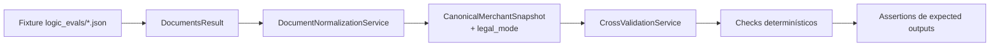
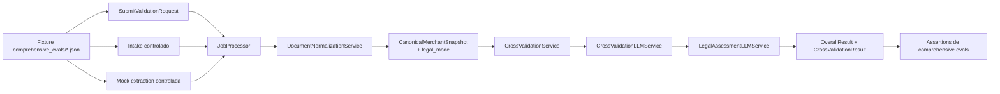

# Onboarding Aliados Document Validator

Servicio asíncrono en Google Cloud con Gemini para validar documentos legales de onboarding y cruzar información de aliados para Cashea.

## Resumen

Este repositorio define el MVP de un validador documental para onboarding de aliados. El sistema recibe URLs de documentos ya tipados por Cashea, extrae información estructurada según el tipo de documento, normaliza los datos y ejecuta validaciones cruzadas para determinar si el caso puede aprobarse, rechazarse o requiere revisión manual.

El diseño actual parte de una arquitectura Google-native y elimina dependencias del prototipo que ya no aplican al MVP, como la integración con HubSpot y la clasificación automática del tipo de documento.

## Objetivo del MVP

- recibir documentos legales mediante una API asíncrona
- descargar y validar archivos desde URLs provistas por Cashea
- extraer datos con Gemini según el tipo documental
- normalizar campos legales y fiscales a un modelo interno común
- cruzar la información entre documentos
- retornar un veredicto con evidencia y motivos claros

## Documentación

- Plan por etapas: [docs/Stages_Plan_v1.md](docs/Stages_Plan_v1.md)
- Especificación de API: [docs/API_Spec_v2.md](docs/API_Spec_v2.md)
- Arquitectura MVP: [docs/Architecture_v2.md](docs/Architecture_v2.md)
- Casos reales de prueba y política de uso: [docs/Real_Test_Cases_v1.md](docs/Real_Test_Cases_v1.md)
- Estrategia de evals: [docs/Evals_Strategy_v1.md](docs/Evals_Strategy_v1.md)
- Real extraction evals locales: [docs/Real_Extraction_Evals_v1.md](docs/Real_Extraction_Evals_v1.md)

## Estado del plan

- [x] Etapa 1: base desplegable
- [x] Etapa 2: jobs y ejecución local
- [x] Etapa 3: descarga y validación técnica de archivos
- [x] Etapa 4: extracción por tipo documental
- [x] Etapa 5: normalización de datos
- [x] Etapa 6: validación cruzada base
- [x] Etapa 7: evals lógicos, de extracción y comprehensive en CI/CD
- [ ] Etapa 8: profundización de reglas y semántica del resultado
- [ ] Etapa 9: infraestructura async real en GCP
- [ ] Etapa 10: staging, observabilidad y piloto

Estado actual:
- Etapa 7 ya cubre `unit tests`, `logic evals`, `extraction evals` y `comprehensive evals` en GitHub Actions.
- Etapa 8 está en progreso con validación híbrida:
  - reglas determinísticas
  - `CrossValidationLLMService`
  - `LegalAssessmentLLMService`
- Los `real extraction evals` quedan como un track manual/posterior mientras se valida la estrategia final de hosting y acceso a documentos por URL.

## Alcance actual

Incluido:

- API asíncrona para crear jobs y consultar estado
- validación técnica de documentos por URL
- procesamiento local `inline` para pruebas
- extracción real con Gemini vía Vertex AI para `rif`, `cedula`, `acta_constitutiva`, `acta_mercantil` y `certificado_emprendimiento`
- extracción paralela por documento
- normalización a snapshot canónico interno
- validaciones cruzadas híbridas sobre datos normalizados:
  - checks determinísticos
  - validación contextual con LLM
  - assessment legal con LLM
- cobertura real validada para `sociedad mercantil`, `emprendimiento` y `firma personal`
- prompts reutilizados del workflow original de `n8n`, adaptados al contrato del backend

Excluido del MVP:

- integración con HubSpot
- clasificación automática de documentos
- generación de contratos
- backoffice de revisión manual

## Flujo propuesto

1. Cashea envía un `merchant_id` y un conjunto de documentos tipados.
2. La API crea un `job` y lo encola para procesamiento.
3. Un worker descarga los archivos y ejecuta extracción estructurada con Gemini.
4. Los resultados se normalizan a un esquema interno canónico.
5. El motor de validación cruzada compara identidad, RIF, razón social, vigencia, precedencia y facultades.
6. Una capa LLM contextualiza inconsistencias y una capa LLM legal recomienda el veredicto operativo.
7. El sistema persiste el resultado y lo expone a través del endpoint de estado.

## Estado del repositorio

Actualmente este repositorio ya contiene una base funcional del MVP:

- API pública para crear jobs y consultar estado
- worker con flujo de intake técnico y extracción
- extracción real validada contra Vertex AI para `rif`, `cedula`, `acta_constitutiva`, `acta_mercantil` y `certificado_emprendimiento`
- normalización canónica y validación cruzada híbrida
- tres flujos reales probados end-to-end: `sociedad mercantil`, `emprendimiento` y `firma personal`
- framework base de evals por capas con fixtures sanitizados para regresión en CI/CD
- runner local para `real extraction evals`, todavía fuera del CI estándar

Todavía falta implementar:

- persistencia real en `Firestore`
- despacho real con `Cloud Tasks`
- ampliar los evals lógicos, de extracción y comprehensive con más fixtures y expected outputs
- ampliar cobertura y profundidad de validación cruzada

## Cómo fluyen los evals locales

### Logic Evals



### Comprehensive Evals



### Qué valida cada capa

- `logic evals`: reglas puras sobre datos ya extraídos.
- `extraction evals`: contratos de prompts, extractores y selección de modelo.
- `comprehensive evals`: composición interna completa del pipeline sin depender de Vertex AI.
- `real extraction evals`: regresión manual/local del extractor real con documentos aprobados.

### Comandos de eval locales

```bash
pytest -q tests/test_logic_evals.py
pytest -q tests/test_extraction_evals.py
pytest -q tests/test_comprehensive_evals.py
pytest -q tests/test_llm_validation_services.py
pytest -q tests
```

## Probar localmente

### API pública

1. Instala dependencias:

```bash
python3 -m venv .venv
source .venv/bin/activate
pip install -r backend/requirements.txt
```

2. Configura entorno local:

```bash
cp backend/.env.example backend/.env
```

Para prueba local simple, usa:

```bash
JOB_REPOSITORY_MODE=inmemory
JOB_QUEUE_MODE=inline
MOCK_MODE=true
```

Para prueba real con Vertex AI, además necesitas:

```bash
GCP_PROJECT_ID=onboarding-agent-491322
GCP_REGION=us-central1
GEMINI_LOCATION=global
GEMINI_MODEL_SIMPLE=gemini-2.5-flash
GEMINI_MODEL_COMPLEX=gemini-2.5-pro
MAX_EXTRACTION_CONCURRENCY=4
MOCK_MODE=false
```

Y autenticación local de Google:

```bash
gcloud auth login
gcloud auth application-default login
gcloud config set project onboarding-agent-491322
```

Además, el proyecto debe tener:

- `aiplatform.googleapis.com` habilitado
- billing habilitado

3. Levanta la API:

```bash
uvicorn backend.api.main:app --reload
```

4. Verifica healthcheck:

```bash
curl http://127.0.0.1:8000/health
```

5. Crea un job:

```bash
curl -X POST http://127.0.0.1:8000/v1/onboarding/validate \
  -H "Content-Type: application/json" \
  -d '{
    "merchant_id": "98765",
    "request_id": "local-test-001",
    "documents": {
      "rif": [{"url": "https://example.com/rif.pdf", "document_id": "rif-1"}],
      "cedula": [{"url": "https://example.com/cedula.jpg", "document_id": "ced-1"}],
      "certificado_emprendimiento": [],
      "acta_constitutiva": [{"url": "https://example.com/acta.pdf", "document_id": "acta-1"}],
      "acta_mercantil": []
    }
  }'
```

6. Consulta status:

Primera llamada:

```bash
curl -X POST http://127.0.0.1:8000/v1/onboarding/status \
  -H "Content-Type: application/json" \
  -d '{"job_ids":["val_REPLACE_ME"]}'
```

Segunda llamada:

```bash
curl -X POST http://127.0.0.1:8000/v1/onboarding/status \
  -H "Content-Type: application/json" \
  -d '{"job_ids":["val_REPLACE_ME"]}'
```

Con `JOB_QUEUE_MODE=inline`, el worker se ejecuta dentro del mismo proceso y el job usualmente aparecerá como `COMPLETED` en el primer status poll.

En `MOCK_MODE=true`, la extracción devuelve datos mock.

En `MOCK_MODE=false`, hoy ya se validó extracción real con Vertex AI para:

- `rif`
- `cedula`
- `acta_constitutiva`
- `acta_mercantil`
- `certificado_emprendimiento`

Además, el pipeline ya ejecuta:

- normalización a snapshot canónico
- checks cruzados de razón social, cédula, vigencia de RIF, vigencia de junta, precedencia documental y facultad de firma
- validación cruzada contextual con `CrossValidationLLMService`
- assessment legal con `LegalAssessmentLLMService`
- lógica de matching por identidad para casos de `emprendimiento` y `firma personal`

Para habilitar la capa híbrida completa en local, agrega además:

```bash
ENABLE_LLM_CROSS_VALIDATION=true
ENABLE_LLM_LEGAL_ASSESSMENT=true
```

### Worker

Si quieres levantar el worker localmente:

```bash
uvicorn backend.worker.main:app --reload --port 8001
```

### Estado actual de implementación

Por ahora el API:

- crea jobs
- puede despachar inline para prueba local
- valida técnicamente URLs y tipos de archivo antes de seguir
- extrae en paralelo por documento
- normaliza resultados a un modelo interno común
- ejecuta validaciones cruzadas híbridas
- devuelve resultado consistente con el contrato base

Todavía no hace:

- persistencia real en `Firestore`
- procesamiento real con `Cloud Tasks` en un entorno GCP configurado
- validación legal completa para todos los escenarios finos del negocio
- cobertura completa de validación cruzada y reglas de negocio
