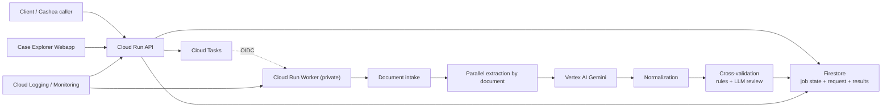
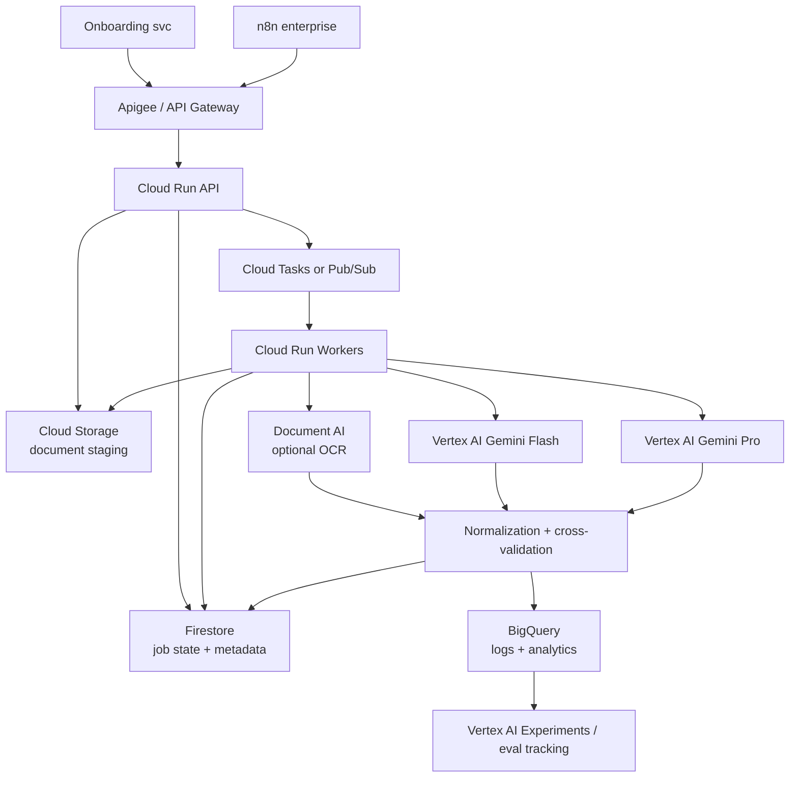

# Current vs Target Architecture

## Purpose

This document separates:

- the **current MVP architecture already running in GCP**
- the **target enterprise architecture requested by Cashea**

That distinction matters because the MVP is already functional for the expected pilot volume, while some enterprise components remain a deliberate next step rather than a blocker.

## Current Architecture

The current implementation is a Google-native async pipeline optimized for MVP speed and operator visibility.

### Implemented Components

- `Cloud Run API`
- `Cloud Run Worker`
- `Firestore`
- `Cloud Tasks`
- `Vertex AI Gemini`
- `Cloud Logging`
- `Cloud Monitoring`
- internal `Case Explorer` webapp on `Cloud Run` protected with `IAP`

### Runtime Flow

### Why the current architecture works for the MVP

- It already supports async processing and status polling.
- It already runs end-to-end in GCP.
- It already supports real documents through signed URLs.
- It already has dashboards, structured logs, and a case explorer.
- It already handles the expected MVP volume range far below typical Cloud Run / Cloud Tasks limits.

## Target Architecture Requested by Cashea

The original target architecture adds enterprise controls, analytics, and optional OCR specialization.

### Target Components

- `Apigee` or gateway layer
- `Cloud Run API`
- `Firestore`
- `Cloud Tasks` or `Pub/Sub`
- `Cloud Storage`
- `Cloud Run Workers`
- optional `Document AI`
- `Vertex AI Gemini Flash`
- `Vertex AI Gemini Pro`
- `BigQuery`
- `Vertex AI Experiments`

### Target Flow

## Gap Analysis

### Already aligned

- async API contract
- separated API and worker
- explicit job persistence
- Google-native deployment
- LLM-based extraction and validation
- observability and operational visibility

### Still pending

- `Apigee`
- `Cloud Storage` as a required staging boundary
- `Document AI` as an OCR complement
- `BigQuery` for analytics and historical reporting
- `Vertex AI Experiments` for formal eval tracking
- full environment topology in the final Cashea GCP project

## Decision Framing

### For the MVP / pilot

The current architecture is sufficient and already functional.

### For the post-MVP next step

The target Cashea architecture should be treated as the next architecture-hardening phase after:

- MVP validation
- pilot confirmation
- deployment into Cashea's own GCP project

That is the right moment to decide which of these become mandatory:

- `Apigee`
- `Cloud Storage`
- `Document AI`
- `BigQuery`
- `Vertex AI Experiments`
