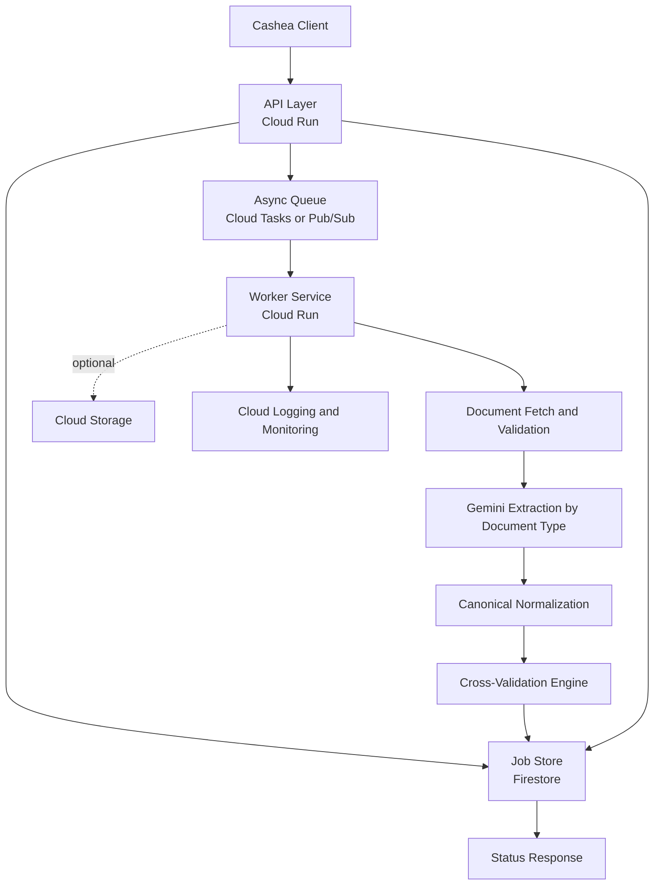

# Onboarding Agent Architecture v2

## Goal

Define the revised MVP architecture for Cashea onboarding document validation using Google Cloud and Gemini.

This version removes prototype-only components such as HubSpot ingestion and document classification. The request payload already provides document URLs and document types.

## Architecture Summary

The system is a Google-native asynchronous processing pipeline:

1. Cashea submits a validation job with typed document URLs.
2. The API persists the job and enqueues background processing.
3. A worker downloads documents, extracts structured data with Gemini, normalizes it, and runs cross-validation.
4. Results are stored and exposed through the status endpoint.

## Recommended MVP Components

### API Layer

- `Cloud Run` service for the public API
- Optional `API Gateway` or `Apigee` for auth, quotas, and traffic controls

Responsibilities:

- request validation
- authentication
- job creation
- initial persistence
- status retrieval

### Async Processing

- `Cloud Tasks` or `Pub/Sub`

Recommendation:

- use `Cloud Tasks` if you want tighter per-job control and simpler retry semantics
- use `Pub/Sub` if you expect higher fan-out or more event-driven extensions later

### Worker Layer

- `Cloud Run` worker service

Responsibilities:

- download documents
- validate file integrity
- call Gemini per document type
- normalize extracted data
- run cross-validation rules
- persist results

### Storage and State

- `Firestore` for job state, progress, extracted outputs, and final results
- `Cloud Storage` for optional temporary file staging

### AI Layer

- `Vertex AI Gemini`

Recommended usage:

- one structured extraction prompt per document type
- optionally use a stronger model for long legal documents and a faster model for simple identity/fiscal documents
- keep prompt outputs strict and schema-validated

### Security and Operations

- `Secret Manager` for secrets
- `Cloud Logging` for structured logs
- `Cloud Monitoring` for uptime and error alerts

## Logical Flow

## Internal Processing Stages

### 1. Intake

Input:

- `merchant_id`
- typed document URLs

Checks:

- supported document type
- URL reachability
- file size and MIME
- duplicate document handling rules

### 2. Extraction

Route each file directly by provided type:

- `rif`
- `cedula`
- `acta_constitutiva`
- `acta_mercantil`
- `certificado_emprendimiento`

Each extractor returns structured JSON and confidence.

### 3. Normalization

Map extracted data into a canonical case model.

Examples:

- normalize ID formats
- normalize company names
- normalize dates
- derive entity type
- derive signature authority structure

### 4. Cross-Validation

Compare normalized fields across documents.

Examples:

- RIF company name vs constitutive company name
- representative ID vs legal representative list
- board validity vs current date
- signature mode vs number of representatives provided

### 5. Verdict Composition

Produce:

- document-level results
- cross-validation check results
- case-level verdict

## Data Boundaries

### External Contract

Stable and customer-facing:

- submit validation request
- poll job status
- consume structured results

### Internal Model

Flexible and implementation-facing:

- extractor output schemas
- canonical normalization model
- validation rule outputs

This separation is important so internal prompt changes do not break Cashea integration.

## MVP Architecture Decisions

### Keep

- async processing
- Google-native deployment
- Gemini-based structured extraction
- explicit state persistence
- deterministic cross-validation rules

### Remove

- document classification stage
- CRM ingestion
- workflow-engine-specific dependencies in the public design

### Defer

- advanced analytics warehouse
- eval platform beyond baseline regression testing
- manual-review backoffice UI

## Suggested Evolution Path

### MVP

- one API service
- one worker service
- Firestore state store
- Cloud Tasks queue
- Gemini extraction and validation

### Next Phase

- split extraction and validation workers if latency or cost requires it
- add gateway controls
- add BigQuery for analytics and auditing
- add evaluation pipelines and benchmark dashboards

## Operational Concerns

- signed URLs may expire during retries
- long legal documents will dominate latency and cost
- logs must avoid leaking sensitive PII unnecessarily
- model timeouts and malformed outputs must be recoverable
- every verdict should be traceable to extraction evidence and rule outcomes
