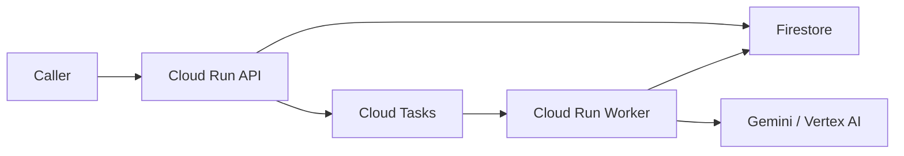

# GCP Deployment

Esta carpeta es la fuente de verdad operativa para desplegar la arquitectura en Google Cloud.

## Contenido

- `env.template`: variables base para despliegue
- `env.dev.template`: configuración ejemplo para `dev`
- `env.staging.template`: configuración ejemplo para `staging`
- `env.prod.template`: configuración ejemplo para `prod`
- `common.sh`: helpers compartidos
- `bootstrap.sh`: habilita APIs y crea recursos base
- `deploy_worker.sh`: build y deploy del worker a Cloud Run
- `deploy_api.sh`: build y deploy del API a Cloud Run
- `deploy_case_explorer.sh`: build y deploy de la webapp interna de exploración de casos
- `deploy_all.sh`: secuencia completa de bootstrap + deploy
- `create_log_metrics.sh`: crea o actualiza métricas basadas en logs estructurados
- `create_dashboards.sh`: crea o actualiza dashboards en Cloud Monitoring
- `deploy_observability.sh`: aplica métricas + dashboards
- `smoke_test.sh`: prueba básica contra el API desplegado

## Docker y builds locales

Los tres servicios se construyen desde el root del repo usando el contexto completo y un `.dockerignore` en la raíz para reducir archivos no necesarios en la imagen.

Imágenes principales:

- API: `backend/Dockerfile.api`
- Worker: `backend/Dockerfile.worker`
- Case Explorer: `webapp/Dockerfile`

Ejemplos de build local:

```bash
docker build -f backend/Dockerfile.api -t onboarding-api:local .
docker build -f backend/Dockerfile.worker -t onboarding-worker:local .
docker build -f webapp/Dockerfile -t onboarding-case-explorer:local .
```

Ejemplos de run local:

```bash
docker run --rm -p 8080:8080 --env-file backend/.env onboarding-api:local
docker run --rm -p 8081:8080 --env-file backend/.env onboarding-worker:local
docker run --rm -p 8082:8080 --env-file webapp/.env onboarding-case-explorer:local
```

Notas:

- las imágenes corren con usuario no-root
- el contexto de build excluye archivos pesados o no necesarios como `.git`, `.venv`, `tests`, `.private_docs` y exportes temporales de documentación
- los deploys de GCP siguen publicando `linux/amd64` para compatibilidad con Cloud Run

## Validación de Fase 1 del scaffold TypeScript

Además del stack Python actual, el repo ahora incluye un scaffold TypeScript/Nest en:

- `apps/api`
- `apps/worker`
- `apps/case-explorer`

Esta validación de Fase 1 no reemplaza el runtime actual. Sirve para comprobar que el scaffold TS:

- compila
- se containeriza
- puede desplegarse en Cloud Run
- responde en endpoints básicos de salud

Dockerfiles TypeScript:

- API TS: `apps/api/Dockerfile`
- Worker TS: `apps/worker/Dockerfile`
- Case Explorer TS: `apps/case-explorer/Dockerfile`

Builds locales de validación:

```bash
docker build -f apps/api/Dockerfile -t onboarding-api-ts:local .
docker build -f apps/worker/Dockerfile -t onboarding-worker-ts:local .
docker build -f apps/case-explorer/Dockerfile -t onboarding-case-explorer-ts:local .
```

Run local de validación:

```bash
docker run --rm -p 9080:8080 onboarding-api-ts:local
docker run --rm -p 9081:8080 onboarding-worker-ts:local
docker run --rm -p 9082:8080 onboarding-case-explorer-ts:local
```

Endpoints esperados:

- API TS:
  - `GET /health`
  - `GET /api/docs`
- Worker TS:
  - `GET /health`
  - `POST /internal/process-job`
- Case Explorer TS:
  - `GET /`

### Deploy paralelo en GCP

Los scripts de validación TS despliegan servicios separados para no interferir con el stack Python:

- `deploy_ts_api.sh`
- `deploy_ts_worker.sh`
- `deploy_ts_case_explorer.sh`
- `deploy_ts_phase1_validation.sh`
- `deploy_ts_all.sh`
- `smoke_test_ts.sh`

Variables nuevas relevantes:

- `TS_API_SERVICE_NAME`
- `TS_WORKER_SERVICE_NAME`
- `TS_CASE_EXPLORER_SERVICE_NAME`
- `TS_IMAGE_TAG`
- `TS_API_ALLOW_UNAUTHENTICATED`
- `TS_CASE_EXPLORER_ALLOW_UNAUTHENTICATED`

Imágenes TS en Artifact Registry:

- `${REGION}-docker.pkg.dev/${PROJECT_ID}/${ARTIFACT_REPOSITORY}/onboarding-api-ts:${TS_IMAGE_TAG}`
- `${REGION}-docker.pkg.dev/${PROJECT_ID}/${ARTIFACT_REPOSITORY}/onboarding-worker-ts:${TS_IMAGE_TAG}`
- `${REGION}-docker.pkg.dev/${PROJECT_ID}/${ARTIFACT_REPOSITORY}/onboarding-case-explorer-ts:${TS_IMAGE_TAG}`

Ejemplo de deploy:

```bash
source infra/gcp/.env.dev
bash infra/gcp/deploy_ts_phase1_validation.sh
```

Deploy consolidado del stack TS:

```bash
source infra/gcp/.env.dev
bash infra/gcp/deploy_ts_all.sh
```

Qué valida esta fase:

- build de imágenes TS
- push a Artifact Registry
- deploy paralelo en Cloud Run
- health checks básicos

Qué no valida todavía:

- paridad funcional completa con Python
- integración real con Firestore / Cloud Tasks / Vertex AI
- comportamiento de negocio end-to-end

Smoke test del stack TS ya funcional:

```bash
source infra/gcp/.env.dev
bash infra/gcp/smoke_test_ts.sh
```

Esto valida:

- salud del API TS
- `POST /v1/onboarding/validate`
- polling de `POST /v1/onboarding/status`
- finalización del job en el stack TS

## Imágenes publicadas en GCP

Los scripts de deploy no usan imágenes guardadas en el repo. Construyen y publican imágenes en `Artifact Registry`.

Nombres de imagen actuales:

- API:
  - `${REGION}-docker.pkg.dev/${PROJECT_ID}/${ARTIFACT_REPOSITORY}/onboarding-api:${IMAGE_TAG}`
- Worker:
  - `${REGION}-docker.pkg.dev/${PROJECT_ID}/${ARTIFACT_REPOSITORY}/onboarding-worker:${IMAGE_TAG}`
- Case Explorer:
  - `${REGION}-docker.pkg.dev/${PROJECT_ID}/${ARTIFACT_REPOSITORY}/onboarding-case-explorer:${IMAGE_TAG}`

Estas rutas se resuelven desde:

- `api_image()` en `infra/gcp/common.sh`
- `worker_image()` en `infra/gcp/common.sh`
- `case_explorer_image()` en `infra/gcp/common.sh`

Ejemplo para listar las imágenes publicadas:

```bash
gcloud artifacts docker images list \
  ${REGION}-docker.pkg.dev/${PROJECT_ID}/${ARTIFACT_REPOSITORY}
```

Ejemplo para inspeccionar tags de una imagen:

```bash
gcloud artifacts docker tags list \
  ${REGION}-docker.pkg.dev/${PROJECT_ID}/${ARTIFACT_REPOSITORY}/onboarding-api
```

## Prerrequisitos

- `gcloud` autenticado
- `docker buildx` disponible
- proyecto GCP con billing habilitado
- permisos para:
  - habilitar APIs
  - crear Firestore
  - crear Artifact Registry
  - crear Cloud Tasks
  - desplegar Cloud Run
  - modificar IAM

## Variables

Parte de uno de los templates y crea un archivo local, por ejemplo:

```bash
cp infra/gcp/env.staging.template infra/gcp/.env.staging
```

Luego edítalo y cárgalo antes de ejecutar scripts:

```bash
source infra/gcp/.env.staging
```

Variables más importantes:

- `PROJECT_ID`
- `REGION`
- `FIRESTORE_LOCATION`
- `ARTIFACT_REPOSITORY`
- `CLOUD_TASKS_QUEUE_ID`
- `API_SERVICE_NAME`
- `WORKER_SERVICE_NAME`
- `API_RUNTIME_SERVICE_ACCOUNT_EMAIL`
- `WORKER_RUNTIME_SERVICE_ACCOUNT_EMAIL`
- `CLOUD_TASKS_SERVICE_ACCOUNT_EMAIL`
- `CASE_EXPLORER_SERVICE_NAME`
- `CASE_EXPLORER_RUNTIME_SERVICE_ACCOUNT_EMAIL`
- `WORKER_AUTH_TOKEN`
- `WEBAPP_SESSION_SECRET`
- `CASE_EXPLORER_AUTH_MODE`
- `CASE_EXPLORER_ENABLE_IAP`
- `CASE_EXPLORER_IAP_MEMBERS`
- `GOOGLE_OAUTH_CLIENT_ID`
- `ALLOWED_GOOGLE_DOMAINS`
- `ALLOWED_GOOGLE_EMAILS`
- `IMAGE_TAG`
- `API_CPU`, `API_MEMORY`, `API_TIMEOUT`, `API_CONCURRENCY`, `API_MIN_INSTANCES`, `API_MAX_INSTANCES`
- `WORKER_CPU`, `WORKER_MEMORY`, `WORKER_TIMEOUT`, `WORKER_CONCURRENCY`, `WORKER_MIN_INSTANCES`, `WORKER_MAX_INSTANCES`
- `CASE_EXPLORER_CPU`, `CASE_EXPLORER_MEMORY`, `CASE_EXPLORER_TIMEOUT`, `CASE_EXPLORER_CONCURRENCY`, `CASE_EXPLORER_MIN_INSTANCES`, `CASE_EXPLORER_MAX_INSTANCES`
- `CLOUD_TASKS_MAX_DISPATCHES_PER_SECOND`
- `CLOUD_TASKS_MAX_CONCURRENT_DISPATCHES`
- `CLOUD_TASKS_MAX_ATTEMPTS`
- `CLOUD_TASKS_MAX_RETRY_SECONDS`
- `OBSERVABILITY_DASHBOARD_NAME`
- `OBSERVABILITY_JOB_METRIC_PREFIX`
- `OBSERVABILITY_LLM_METRIC_PREFIX`
- `OBSERVABILITY_EXTRACTION_METRIC_PREFIX`

Templates recomendados:

- `env.dev.template`: para pruebas internas rápidas o sandboxes
- `env.staging.template`: para validación operativa pre-piloto
- `env.prod.template`: base para producción, con `MOCK_MODE=false`
- `TS_WORKER_MOCK_MODE`: permite correr el worker TypeScript con extracción real aunque el ambiente conserve `MOCK_MODE=true` para otros paths de validación

## Orden recomendado

### 1. Bootstrap

```bash
source infra/gcp/.env.dev
bash infra/gcp/bootstrap.sh
```

Esto:

- habilita APIs necesarias
- crea Firestore si no existe
- crea Artifact Registry si no existe
- crea la cola de Cloud Tasks si no existe
- crea service accounts dedicadas si no existen
- aplica IAM mínimo para Firestore, Vertex AI, Cloud Tasks y worker privado
- configura la cola de Cloud Tasks con límites explícitos de dispatch y retry

### 2. Deploy del worker

```bash
source infra/gcp/.env.dev
bash infra/gcp/deploy_worker.sh
```

### 3. Deploy del API

```bash
source infra/gcp/.env.dev
bash infra/gcp/deploy_api.sh
```

### 4. Smoke test

```bash
source infra/gcp/.env.dev
bash infra/gcp/smoke_test.sh
```

### 5. Deploy de la webapp interna

```bash
source infra/gcp/.env.dev
bash infra/gcp/deploy_case_explorer.sh
```

Notas:

- en `CASE_EXPLORER_ENABLE_IAP=true`, la `run.app` URL queda protegida con login de Google vía IAP
- los usuarios o grupos permitidos se definen en `CASE_EXPLORER_IAP_MEMBERS`, por ejemplo:
  - `user:victor@getpathpilot.com`
  - `group:onboarding-agent-internal@cashea.app`
- en `CASE_EXPLORER_AUTH_MODE=disabled`, la app delega el login al perímetro de Cloud Run/IAP
- en `CASE_EXPLORER_AUTH_MODE=google`, necesitas configurar `GOOGLE_OAUTH_CLIENT_ID` y usar la auth propia de la app
- la webapp llama al `onboarding-api` internamente usando la service account de Cloud Run

### 6. Observabilidad

```bash
source infra/gcp/.env.dev
bash infra/gcp/deploy_observability.sh
```

Esto:

- crea métricas basadas en logs para jobs, extracción y llamadas LLM
- crea o actualiza un dashboard de Cloud Monitoring
- deja visible el flujo operativo del pipeline sin tocar el código de despliegue

## Atajo

Para correr todo en secuencia:

```bash
source infra/gcp/.env.dev
bash infra/gcp/deploy_all.sh
```

## Arquitectura esperada



## Notas operativas

- Los builds se publican en `linux/amd64` para compatibilidad con Cloud Run.
- El worker se despliega privado.
- La webapp interna puede desplegarse pública con auth en aplicación (`CASE_EXPLORER_AUTH_MODE=google`) o en modo temporal `disabled` para ambientes controlados.
- Para acceso browser corporativo, la opción recomendada es `CASE_EXPLORER_ENABLE_IAP=true`.
- Cloud Tasks invoca al worker con `OIDC` usando `CLOUD_TASKS_SERVICE_ACCOUNT_EMAIL`.
- La webapp usa su propia runtime service account y obtiene un ID token server-side para llamar al `onboarding-api`.
- Los scripts de deploy ya parametrizan `cpu`, `memory`, `timeout`, `concurrency`, `min-instances` y `max-instances` por servicio.
- La cola de Cloud Tasks también queda parametrizada por ambiente para facilitar movernos de PathPilot a Cashea sin editar código.
- El `api` runtime service account necesita `roles/iam.serviceAccountUser` sobre `CLOUD_TASKS_SERVICE_ACCOUNT_EMAIL` para poder encolar tareas con `oidc_token`.
- `api`, `worker` y `Cloud Tasks` ya no dependen de la compute default service account.
- Los logs de API y worker salen en JSON estructurado y se pueden consultar por `jsonPayload.event`.
- La aplicación todavía puede correrse localmente con:
  - `JOB_REPOSITORY_MODE=inmemory`
  - `JOB_QUEUE_MODE=inline`
- Para validar la infraestructura real, usa:
  - `JOB_REPOSITORY_MODE=firestore`
  - `JOB_QUEUE_MODE=cloud_tasks`

## Estado actual

Ya se probó exitosamente en GCP:

- Firestore real
- Cloud Tasks real
- Cloud Run API
- Cloud Run worker privado
- submit -> queue -> worker -> Firestore -> status

## Checklist para movernos a otro proyecto GCP

1. copiar el template adecuado a un archivo local fuera de git
2. cambiar `PROJECT_ID`, nombres de servicios, nombres de service accounts y `FIRESTORE_COLLECTION`
3. ajustar `WORKER_AUTH_TOKEN`
4. revisar `MOCK_MODE`, `TS_WORKER_MOCK_MODE` y modelos Gemini del ambiente destino
5. correr `bootstrap.sh`
6. correr `deploy_worker.sh` y `deploy_api.sh`
7. correr `deploy_observability.sh`
8. validar con `smoke_test.sh`

## Eventos estructurados principales

Los dashboards y métricas dependen de estos eventos:

- `api.validation.submit.accepted`
- `job.dispatched.cloud_tasks`
- `worker.job.received`
- `job.stage.updated`
- `document.intake.validated`
- `document.extraction.started`
- `document.extraction.completed`
- `document.extraction.failed`
- `llm.request.started`
- `llm.request.completed`
- `llm.request.failed`
- `job.completed`
- `job.failed`
