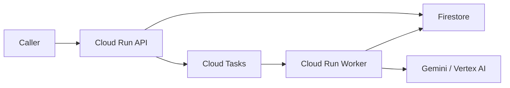

# GCP Deployment

Esta carpeta es la fuente de verdad operativa para desplegar la arquitectura en Google Cloud.

## Contenido

- `env.template`: variables base para despliegue
- `common.sh`: helpers compartidos
- `bootstrap.sh`: habilita APIs y crea recursos base
- `deploy_worker.sh`: build y deploy del worker a Cloud Run
- `deploy_api.sh`: build y deploy del API a Cloud Run
- `deploy_all.sh`: secuencia completa de bootstrap + deploy
- `smoke_test.sh`: prueba básica contra el API desplegado

## Prerrequisitos

- `gcloud` autenticado
- `docker buildx` disponible
- proyecto GCP con billing habilitado
- permisos para:
  - habilitar APIs
  - crear Firestore
  - crear Artifact Registry
  - crear Cloud Tasks
  - desplegar Cloud Run
  - modificar IAM

## Variables

Parte de `infra/gcp/env.template` y crea un archivo local, por ejemplo:

```bash
cp infra/gcp/env.template infra/gcp/.env.dev
```

Luego edítalo y cárgalo antes de ejecutar scripts:

```bash
source infra/gcp/.env.dev
```

Variables más importantes:

- `PROJECT_ID`
- `REGION`
- `FIRESTORE_LOCATION`
- `ARTIFACT_REPOSITORY`
- `CLOUD_TASKS_QUEUE_ID`
- `API_SERVICE_NAME`
- `WORKER_SERVICE_NAME`
- `API_RUNTIME_SERVICE_ACCOUNT_EMAIL`
- `WORKER_RUNTIME_SERVICE_ACCOUNT_EMAIL`
- `CLOUD_TASKS_SERVICE_ACCOUNT_EMAIL`
- `WORKER_AUTH_TOKEN`
- `IMAGE_TAG`

## Orden recomendado

### 1. Bootstrap

```bash
source infra/gcp/.env.dev
bash infra/gcp/bootstrap.sh
```

Esto:

- habilita APIs necesarias
- crea Firestore si no existe
- crea Artifact Registry si no existe
- crea la cola de Cloud Tasks si no existe
- crea service accounts dedicadas si no existen
- aplica IAM mínimo para Firestore, Vertex AI, Cloud Tasks y worker privado

### 2. Deploy del worker

```bash
source infra/gcp/.env.dev
bash infra/gcp/deploy_worker.sh
```

### 3. Deploy del API

```bash
source infra/gcp/.env.dev
bash infra/gcp/deploy_api.sh
```

### 4. Smoke test

```bash
source infra/gcp/.env.dev
bash infra/gcp/smoke_test.sh
```

## Atajo

Para correr todo en secuencia:

```bash
source infra/gcp/.env.dev
bash infra/gcp/deploy_all.sh
```

## Arquitectura esperada



## Notas operativas

- Los builds se publican en `linux/amd64` para compatibilidad con Cloud Run.
- El worker se despliega privado.
- Cloud Tasks invoca al worker con `OIDC` usando `CLOUD_TASKS_SERVICE_ACCOUNT_EMAIL`.
- `api`, `worker` y `Cloud Tasks` ya no dependen de la compute default service account.
- La aplicación todavía puede correrse localmente con:
  - `JOB_REPOSITORY_MODE=inmemory`
  - `JOB_QUEUE_MODE=inline`
- Para validar la infraestructura real, usa:
  - `JOB_REPOSITORY_MODE=firestore`
  - `JOB_QUEUE_MODE=cloud_tasks`

## Estado actual

Ya se probó exitosamente en GCP:

- Firestore real
- Cloud Tasks real
- Cloud Run API
- Cloud Run worker privado
- submit -> queue -> worker -> Firestore -> status
