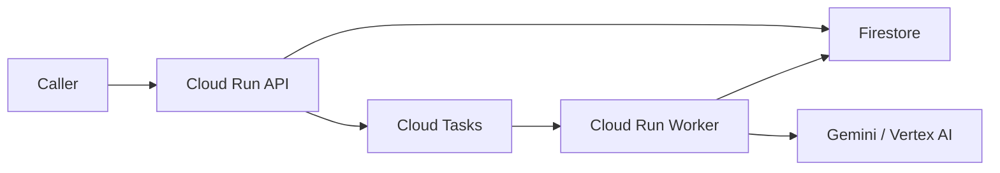

# GCP Deployment

Esta carpeta es la fuente de verdad operativa para desplegar la arquitectura en Google Cloud.

## Contenido

- `env.template`: variables base para despliegue
- `env.dev.template`: configuración ejemplo para `dev`
- `env.staging.template`: configuración ejemplo para `staging`
- `env.prod.template`: configuración ejemplo para `prod`
- `common.sh`: helpers compartidos
- `bootstrap.sh`: habilita APIs y crea recursos base
- `deploy_worker.sh`: build y deploy del worker a Cloud Run
- `deploy_api.sh`: build y deploy del API a Cloud Run
- `deploy_all.sh`: secuencia completa de bootstrap + deploy
- `create_log_metrics.sh`: crea o actualiza métricas basadas en logs estructurados
- `create_dashboards.sh`: crea o actualiza dashboards en Cloud Monitoring
- `deploy_observability.sh`: aplica métricas + dashboards
- `smoke_test.sh`: prueba básica contra el API desplegado

## Prerrequisitos

- `gcloud` autenticado
- `docker buildx` disponible
- proyecto GCP con billing habilitado
- permisos para:
  - habilitar APIs
  - crear Firestore
  - crear Artifact Registry
  - crear Cloud Tasks
  - desplegar Cloud Run
  - modificar IAM

## Variables

Parte de uno de los templates y crea un archivo local, por ejemplo:

```bash
cp infra/gcp/env.staging.template infra/gcp/.env.staging
```

Luego edítalo y cárgalo antes de ejecutar scripts:

```bash
source infra/gcp/.env.staging
```

Variables más importantes:

- `PROJECT_ID`
- `REGION`
- `FIRESTORE_LOCATION`
- `ARTIFACT_REPOSITORY`
- `CLOUD_TASKS_QUEUE_ID`
- `API_SERVICE_NAME`
- `WORKER_SERVICE_NAME`
- `API_RUNTIME_SERVICE_ACCOUNT_EMAIL`
- `WORKER_RUNTIME_SERVICE_ACCOUNT_EMAIL`
- `CLOUD_TASKS_SERVICE_ACCOUNT_EMAIL`
- `WORKER_AUTH_TOKEN`
- `IMAGE_TAG`
- `API_CPU`, `API_MEMORY`, `API_TIMEOUT`, `API_CONCURRENCY`, `API_MIN_INSTANCES`, `API_MAX_INSTANCES`
- `WORKER_CPU`, `WORKER_MEMORY`, `WORKER_TIMEOUT`, `WORKER_CONCURRENCY`, `WORKER_MIN_INSTANCES`, `WORKER_MAX_INSTANCES`
- `CLOUD_TASKS_MAX_DISPATCHES_PER_SECOND`
- `CLOUD_TASKS_MAX_CONCURRENT_DISPATCHES`
- `CLOUD_TASKS_MAX_ATTEMPTS`
- `CLOUD_TASKS_MAX_RETRY_SECONDS`
- `OBSERVABILITY_DASHBOARD_NAME`
- `OBSERVABILITY_JOB_METRIC_PREFIX`
- `OBSERVABILITY_LLM_METRIC_PREFIX`
- `OBSERVABILITY_EXTRACTION_METRIC_PREFIX`

Templates recomendados:

- `env.dev.template`: para pruebas internas rápidas o sandboxes
- `env.staging.template`: para validación operativa pre-piloto
- `env.prod.template`: base para producción, con `MOCK_MODE=false`

## Orden recomendado

### 1. Bootstrap

```bash
source infra/gcp/.env.dev
bash infra/gcp/bootstrap.sh
```

Esto:

- habilita APIs necesarias
- crea Firestore si no existe
- crea Artifact Registry si no existe
- crea la cola de Cloud Tasks si no existe
- crea service accounts dedicadas si no existen
- aplica IAM mínimo para Firestore, Vertex AI, Cloud Tasks y worker privado
- configura la cola de Cloud Tasks con límites explícitos de dispatch y retry

### 2. Deploy del worker

```bash
source infra/gcp/.env.dev
bash infra/gcp/deploy_worker.sh
```

### 3. Deploy del API

```bash
source infra/gcp/.env.dev
bash infra/gcp/deploy_api.sh
```

### 4. Smoke test

```bash
source infra/gcp/.env.dev
bash infra/gcp/smoke_test.sh
```

### 5. Observabilidad

```bash
source infra/gcp/.env.dev
bash infra/gcp/deploy_observability.sh
```

Esto:

- crea métricas basadas en logs para jobs, extracción y llamadas LLM
- crea o actualiza un dashboard de Cloud Monitoring
- deja visible el flujo operativo del pipeline sin tocar el código de despliegue

## Atajo

Para correr todo en secuencia:

```bash
source infra/gcp/.env.dev
bash infra/gcp/deploy_all.sh
```

## Arquitectura esperada



## Notas operativas

- Los builds se publican en `linux/amd64` para compatibilidad con Cloud Run.
- El worker se despliega privado.
- Cloud Tasks invoca al worker con `OIDC` usando `CLOUD_TASKS_SERVICE_ACCOUNT_EMAIL`.
- Los scripts de deploy ya parametrizan `cpu`, `memory`, `timeout`, `concurrency`, `min-instances` y `max-instances` por servicio.
- La cola de Cloud Tasks también queda parametrizada por ambiente para facilitar movernos de PathPilot a Cashea sin editar código.
- El `api` runtime service account necesita `roles/iam.serviceAccountUser` sobre `CLOUD_TASKS_SERVICE_ACCOUNT_EMAIL` para poder encolar tareas con `oidc_token`.
- `api`, `worker` y `Cloud Tasks` ya no dependen de la compute default service account.
- Los logs de API y worker salen en JSON estructurado y se pueden consultar por `jsonPayload.event`.
- La aplicación todavía puede correrse localmente con:
  - `JOB_REPOSITORY_MODE=inmemory`
  - `JOB_QUEUE_MODE=inline`
- Para validar la infraestructura real, usa:
  - `JOB_REPOSITORY_MODE=firestore`
  - `JOB_QUEUE_MODE=cloud_tasks`

## Estado actual

Ya se probó exitosamente en GCP:

- Firestore real
- Cloud Tasks real
- Cloud Run API
- Cloud Run worker privado
- submit -> queue -> worker -> Firestore -> status

## Checklist para movernos a otro proyecto GCP

1. copiar el template adecuado a un archivo local fuera de git
2. cambiar `PROJECT_ID`, nombres de servicios, nombres de service accounts y `FIRESTORE_COLLECTION`
3. ajustar `WORKER_AUTH_TOKEN`
4. revisar `MOCK_MODE` y modelos Gemini del ambiente destino
5. correr `bootstrap.sh`
6. correr `deploy_worker.sh` y `deploy_api.sh`
7. correr `deploy_observability.sh`
8. validar con `smoke_test.sh`

## Eventos estructurados principales

Los dashboards y métricas dependen de estos eventos:

- `api.validation.submit.accepted`
- `job.dispatched.cloud_tasks`
- `worker.job.received`
- `job.stage.updated`
- `document.intake.validated`
- `document.extraction.started`
- `document.extraction.completed`
- `document.extraction.failed`
- `llm.request.started`
- `llm.request.completed`
- `llm.request.failed`
- `job.completed`
- `job.failed`
